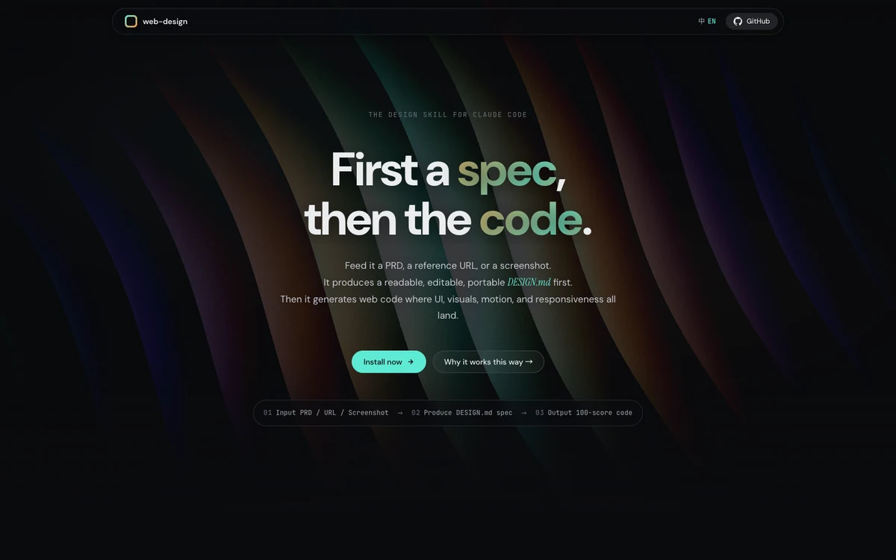

<div align="center">

# web-design

**A Claude Code SKILL for designing beautiful, consistent web pages — spec first, code second.**

[](https://kaopu-xiaopu.github.io/web-design/)

[](./LICENSE)
[](https://kaopu-xiaopu.github.io/web-design/)


<br>

[](https://kaopu-xiaopu.github.io/web-design/)

</div>


## ✨ What it does

Feed the SKILL a **PRD**, a **reference URL**, or a **screenshot** — any combination works. It produces a readable, editable, portable `DESIGN.md` **first**. Only then does it generate the web code.

The result: UI, visuals, motion, and responsiveness that all land. Consistent across pages, portable across AI tools, editable by hand.

## 🧭 How it works

**Phase A · Understand.** Extracts design cues from PRD / URL / screenshot / keywords / brand name. A graceful fallback chain keeps it working even with sparse inputs.

**Phase B · Produce `DESIGN.md`.** A full 9-section spec: color · type · component · layout · motion · depth · do's & don'ts · responsive · accessibility. Once you approve it, the spec lives in your project and can be edited by hand.

**Phase C · Generate code.** Strictly follows the spec. Self-audits against a 100-score quality checklist. Diff-audits when a reference URL exists.


## 📦 Repository layout

```
web-design/
├── SKILL.md            # the skill itself (instructions for Claude)
├── references/         # design systems, style seeds, motion library,
│                       # interaction patterns, quality checklist
├── scripts/            # Playwright crawler, static token extractor,
│                       # Unsplash image fetcher
└── docs/               # landing page (served by GitHub Pages)
    ├── index.html
    ├── styles.css
    ├── app.js
    ├── DESIGN.md       # the page's own spec (produced by the SKILL itself)
    └── images/
```

## 🚀 Install

Clone into your Claude Code skills directory:

```bash
git clone https://github.com/KAOPU-XiaoPu/web-design ~/.claude/skills/web-design
```

Claude Code will auto-discover the SKILL the next time you start a session.

## 💻 Run the landing page locally

```bash
cd web-design/docs
python3 -m http.server 8000
# open http://localhost:8000
```

Opening `index.html` directly with `file://` won't work — Google Fonts and the OGL ES module need an HTTP origin.


## 🙏 Credits

Motion effects on the landing page derive from work by [David Haz](https://github.com/DavidHDev):

- [vue-bits](https://github.com/DavidHDev/vue-bits) (MIT) — GradientBlinds, RollingGallery
- [react-bits](https://github.com/DavidHDev/react-bits) (MIT) — DomeGallery

Reference inspirations for the `DESIGN.md` structure draw from [awesome-design-md](https://github.com/VoltAgent/awesome-design-md) (MIT).

## 📄 License

[MIT](./LICENSE) — use it, fork it, ship it.

---

<div align="center">

**Built with ❤️ by [@KAOPU-XiaoPu](https://github.com/KAOPU-XiaoPu)**

[Live Demo](https://kaopu-xiaopu.github.io/web-design/) · [Report Issues](https://github.com/KAOPU-XiaoPu/web-design/issues) · [Install](#-install)

</div>
